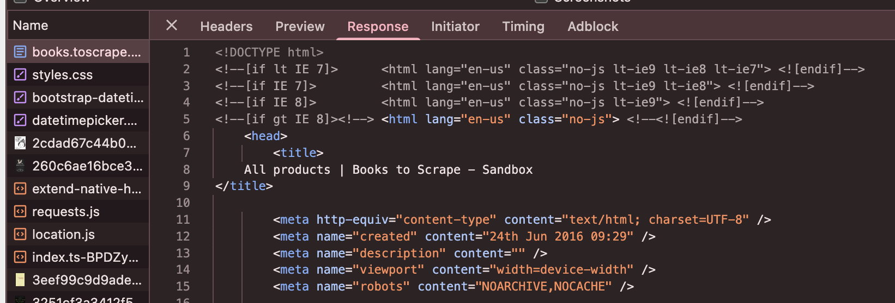
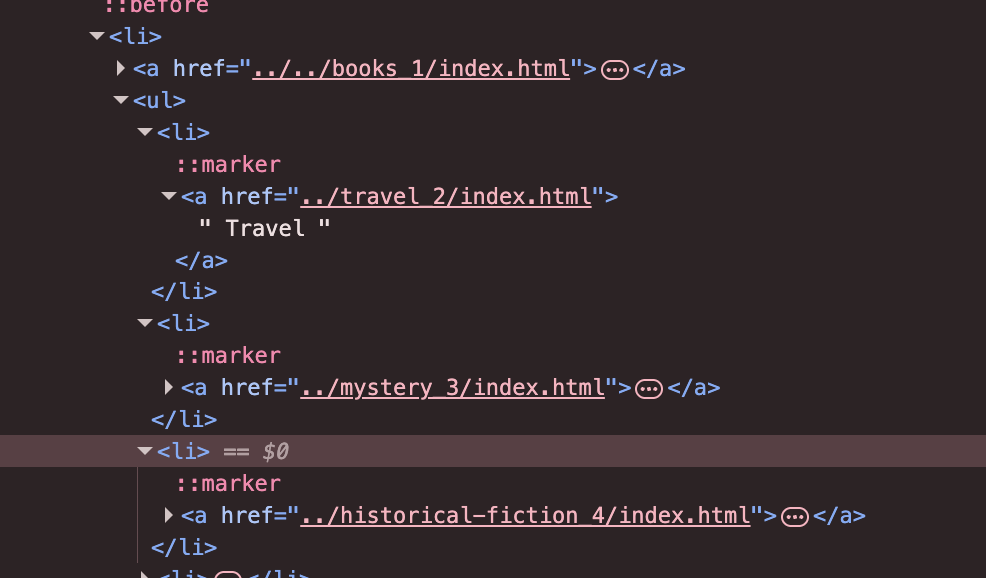
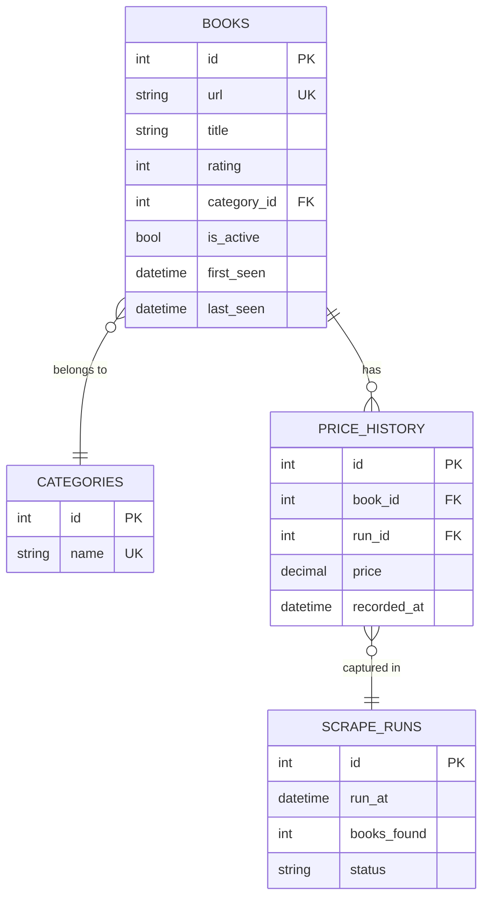
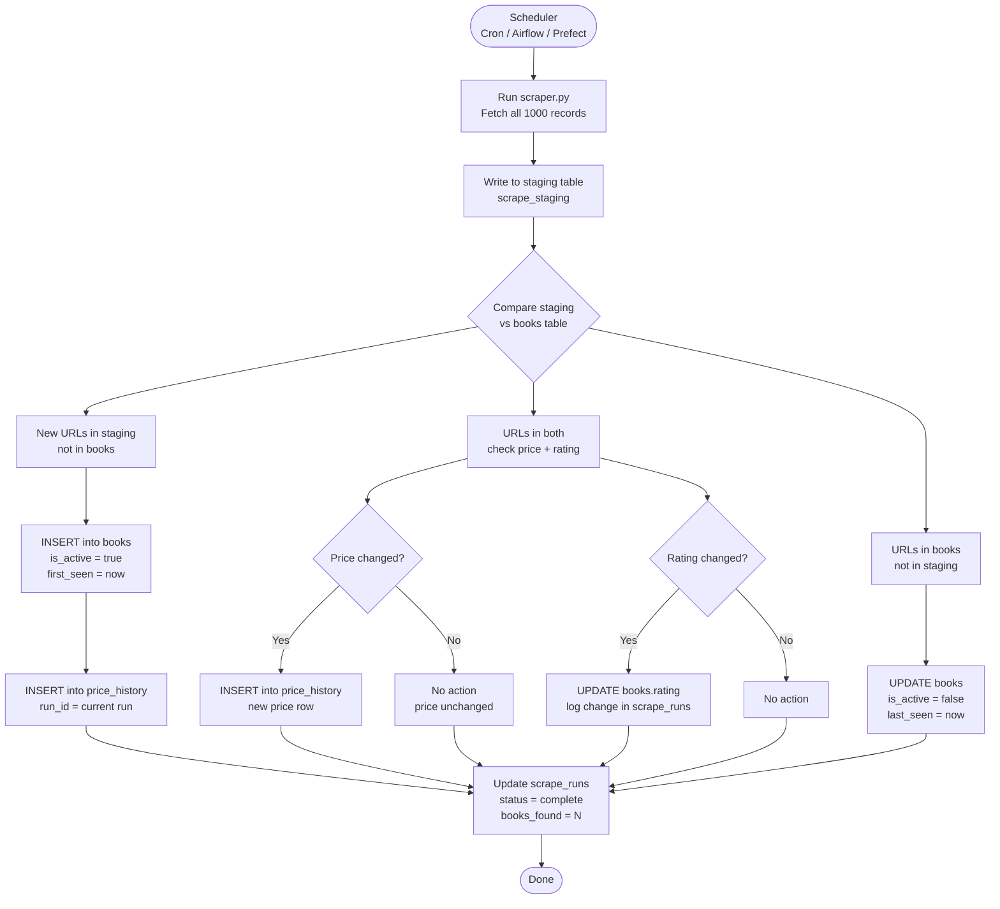

# My Book Scraper for NexMart

I created a Python web scraper built to extract book data from [books.toscrape.com](http://books.toscrape.com). It collects titles, prices, ratings, and URLs across all 50 pages of the catalogue and exports them to a CSV file.

This document walks through the HTML structure I observed, the field-level findings I hit during development, and the database schema and change detection design for a production-grade version of this system.

---

## What Gets Scraped

| Field  | Description |
| ------ | ----------- |
| Title  | The full name of the book, e.g. `A Light in the Attic` |
| URL    | The link to the book's individual page on the site eg `https://books.toscrape.com/catalogue/a-light-in-the-attic_1000/index.html` |
| Price  | The listed price in GBP, e.g. `51.77` |
| Rating | The star rating on a scale of 1 to 5, e.g. `3` |

---

## Data Snapshot

The scraper collected all 1,000 books across 50 pages. These are the actual figures from the current `output.csv`.

| Metric | Value |
| ------ | ----- |
| Total records | 1,000 |
| Price range | £10.00 – £59.99 |
| Average price | £35.07 |

**Rating distribution:**

| Rating | 1 | 2 | 3 | 4 | 5 |
| ------ | --- | --- | --- | --- | --- |
| Count  | 226 | 196 | 203 | 179 | 196 |

**Price by band (£):**

| 10–20 | 20–30 | 30–40 | 40–50 | 50–60 |
| ----- | ----- | ----- | ----- | ----- |
| 196   | 206   | 195   | 205   | 198   |

Prices are spread almost evenly across all bands, the catalogue has no budget or premium skew.

**Average price by rating:**

| Rating    | 1      | 2      | 3      | 4      | 5      |
| --------- | ------ | ------ | ------ | ------ | ------ |
| Avg price | £34.56 | £34.81 | £34.69 | £36.09 | £35.37 |

Rating has no relationship to price  a 1-star book costs roughly the same as a 5-star book.

---

## HTML Structure Observations

### Title, Price, and URL

The title lives inside an anchor (`<a>`) tag. The price is in a class called `product_price > price_color`. The URL comes from the `href` of that same anchor tag.


### Rating

The rating sits on a `<p>` tag with the class `star-rating`. The actual star count is encoded as a second CSS class word like `Three` or `Five`. There is no numeric attribute to read directly, so it requires a mapping step.


### Pagination

The pagination "next" button lives inside a `<li class="next">` element. The href is a relative URL that needs to be merged with the base URL to form a full address. Each page holds 20 books, and the scraper walks through all 50 pages sequentially to collect all 1000 records.


---

## Field Observations

These are the non-obvious things I found while building the scraper. Most of them would have caused silent data corruption if I had not caught them.

### 1. The price field has an encoding artifact, not just a currency symbol

The raw HTML price sometimes looks like `£53.74` depending on how the page is decoded.



```python
response.encoding = 'utf-8'   # gives '£'   (correct)
response.encoding = 'latin-1'  # gives '£'  (the artifact)
```

The pound sign (`£`) is a multi-byte UTF-8 character that renders as `£` when decoded with the wrong encoding. Rather than stripping a known leading character like `£`, I stripped everything that is not a digit or decimal point. This handles both the clean and corrupted rendering without hardcoding any specific character, and it stays safe if other unexpected strings come through.

The site correctly declares `Content-Type: text/html; charset=utf-8` in its response headers, so the artifact only surfaces when something in the pipeline ignores that declaration. We are safe here.

### 2. Book titles are truncated in the `<a>` tag text but the full title is in the `title` attribute

The visible link text for long titles gets cut off with `...` like `"A Light in the ..."`. The full title lives in the `title` attribute of the same `<a>` tag. Using `.text` instead of `["title"]` would have silently truncated roughly 30 to 40 book names. The CSV would look fine at a glance, but the data would be wrong.


### 3. Rating is encoded as a CSS class word, not a number

Star rating is stored as a class on the `<p>` element like `<p class="star-rating Three">`. There is no `data-rating` attribute or numeric value anywhere in the HTML.


I mapped the word to an integer using a static dictionary called `RATING_MAP`. Books with missing or unrecognised ratings default to `0`. This would break silently if the site ever added a `"Six"` or `"Seven"` class since a value of `0` would appear in the output without raising an error. An alternative would be to raise an exception on unknown class values, but that would halt the entire scrape for one bad record. I chose the silent default with the expectation that a downstream schema constraint would catch it.

### 4. Relative URLs in pagination use `../` in deeper catalogue paths

On page 1, the "next" button href is `page-2.html`, relative to `BASE_URL`. On some other pages I noticed relative URLs with `../` prefixes. To handle this uniformly, I stripped all `../` segments before appending to `BASE_URL`. The cleaner approach would be `urllib.parse.urljoin`, which I considered but skipped to avoid over-engineering a site with a predictable and stable URL structure.

### 5. I chose `requests` and `BeautifulSoup` over Scrapy intentionally

Scrapy adds a full framework: spiders, pipelines, settings, and middlewares. For a 50-page linear crawl with no JavaScript rendering, that would be roughly four times more code for the same output. I added a `0.5s` delay between requests manually to be polite to the server. The trade-offs are no built-in rate limiting, no distributed crawl support, and no automatic retry queue. For this scope, those are acceptable gaps.

---

## Database Design

Books on the site are divided into categories, with multiple books falling under each one.



### Diagram 1: Normalized Relational Schema (ERD)



### Key Design Decisions

| Decision                                    | Reasoning                                                                                                                                                                                                                                                                                                                                                                                                                                                                                                                                                                                                                                                                                 |
| ------------------------------------------- | ----------------------------------------------------------------------------------------------------------------------------------------------------------------------------------------------------------------------------------------------------------------------------------------------------------------------------------------------------------------------------------------------------------------------------------------------------------------------------------------------------------------------------------------------------------------------------------------------------------------------------------------------------------------------------------------- |
| `books` is the core entity                  | Each row is one catalogue entry identified by a stable `url`, which the site uses as the canonical ID per book. All other tables reference it.                                                                                                                                                                                                                                                                                                                                                                                                                                                                                                                                            |
| `url` as natural unique key on `books`      | The URL encodes a slug that never changes for a given book on this site. More readable than a surrogate key when debugging. Example: `/scott-pilgrims-precious-little-life-scott-pilgrim-1_987`                                                                                                                                                                                                                                                                                                                                                                                                                                                                                           |
| Price lives in `price_history`, not `books` | Keeps the full historical record intact. Current price is just the latest row for that `book_id`. No data is lost when a price changes. This is the mechanism for change detection shown in Diagram 2.                                                                                                                                                                                                                                                                                                                                                                                                                                                                                    |
| `rating` on `books`, not in history         | Rating on this site appears editorial and static. If it ever changed, the change detection flow in Diagram 2 would catch it and we could promote rating to a history table at that point.                                                                                                                                                                                                                                                                                                                                                                                                                                                                                                 |
| `is_active` flag on `books`                 | Soft-delete approach: when a book disappears from the catalogue we set `is_active = false` and note `last_seen`. Hard deletes would break the price history foreign key chain.                                                                                                                                                                                                                                                                                                                                                                                                                                                                                                            |
| `categories` normalised out                 | Storing category as a raw string on `books` would repeat `"Mystery"` hundreds of times across rows. Instead, `categories` holds each name exactly once and `books` references it via `category_id`. Two concrete benefits: a typo like `"Mysetery"` cannot silently create a phantom category since the FK constraint rejects unknown values, and aggregations like counting books per category work correctly because every book in a category points to the same row, not a loose string. The trade-off is one extra JOIN, which is negligible at this scale. Note: the current scraper does not collect category data, but the product page exposes it and the schema is ready for it. |
| `scrape_runs` as audit log                  | Every run records timestamp, count, and status. This makes diffs possible since change detection compares run N against run N-1. If a run fails mid-way, `status` reflects it and downstream consumers can skip that run's data entirely.                                                                                                                                                                                                                                                                                                                                                                                                                                                 |
| `first_seen` and `last_seen` on `books`     | `first_seen` records when a book first appeared in the catalogue. `last_seen` records when it was last observed — set on the run where `is_active` flipped to false. Together they give the full lifespan of a catalogue entry without needing to query `price_history`.                                                                                                                                                                                                                                                                                                                                                                                                                 |

### Diagram 2: Data Change Detection



### Component Notes

| Component                 | Purpose                                                                                                                                                                                    |
| ------------------------- | ------------------------------------------------------------------------------------------------------------------------------------------------------------------------------------------ |
| `scrape_staging`          | Temporary table holding the latest raw scrape. Wiped and reloaded each run. Prevents partial writes from corrupting the live `books` table.                                                |
| Diff logic (D to E/F/G)   | Three-way comparison: new arrivals, existing books to check for changes, and books that have disappeared. Each branch is independent, so a price change does not affect removal detection. |
| `scrape_runs` log         | Every run records timestamp, count, and status. This is the audit trail. If a run fails mid-way, the `status` column reflects it and downstream consumers can skip that run's data.        |
| Soft delete (`is_active`) | Books that vanish from the catalogue are marked inactive, not deleted. `last_seen` tells you exactly when they disappeared. Price history is fully preserved for trend analysis.           |
| Scheduler                 | Any cron-compatible tool works here. Daily frequency is sufficient for a slow-changing book catalogue. The design supports higher frequency without any changes to the schema.             |

### Example Queries

**Current price of a book:**

```sql
SELECT price
FROM price_history
WHERE book_id = 42
ORDER BY recorded_at DESC
LIMIT 1;
```

**All books whose price dropped since the previous run:**

```sql
SELECT b.title, p_old.price AS price_before, p_new.price AS price_after
FROM price_history p_old
JOIN price_history p_new
  ON p_old.book_id = p_new.book_id
 AND p_new.run_id = p_old.run_id + 1
JOIN books b ON b.id = p_old.book_id
WHERE p_new.price < p_old.price;
```

**Books that have disappeared from the catalogue:**

```sql
SELECT title, last_seen
FROM books
WHERE is_active = false
ORDER BY last_seen DESC;
```

**Price history for a single book over time:**

```sql
SELECT sr.run_at, ph.price
FROM price_history ph
JOIN scrape_runs sr ON sr.id = ph.run_id
WHERE ph.book_id = 42
ORDER BY sr.run_at;
```

---

## Known Limitations

These are the assumptions baked into the current design and how they could fail.

| Assumption | What breaks if it fails |
| ---------- | ----------------------- |
| Rating classes are always one of `Zero`–`Five` | A new class like `"Six"` maps silently to `0`. No error is raised; the output just shows a zero rating. A downstream schema constraint on values 0–5 is the safest backstop. |
| A book's URL slug never changes | If the site re-slugs a title, the scraper treats it as a deletion and a new arrival. Price history is orphaned on the old row. There is no deduplication by title. |
| The "next" pagination button is present until the last page | The scraper follows buttons dynamically, so new pages beyond 50 are handled correctly , the "50 pages" framing in comments is descriptive, not a hardcoded limit. |


---

## Summary

### Schema (ERD)

The normalized schema has 4 tables:

- `books` -- one row per unique book, identified by URL
- `categories` -- normalised out to avoid string repetition across rows
- `price_history` -- every price observation, linked to a specific scrape run
- `scrape_runs` -- audit log of every execution

Current price is the latest `price_history` row for a given `book_id`. Books that disappear from the site are soft-deleted with `is_active = false`, which preserves all historical pricing data.

### Change Detection

Each run writes to a `scrape_staging` table first. A diff then classifies every record into one of three buckets:

- **New URL** -- insert into `books`, log the first price in `price_history`
- **Existing URL, price changed** -- insert a new `price_history` row
- **Existing URL, gone from site** -- set `is_active = false`, record `last_seen`

The `scrape_runs` table ties every price snapshot to the exact run that captured it, making the full history traceable and auditable.

### Thank You!
