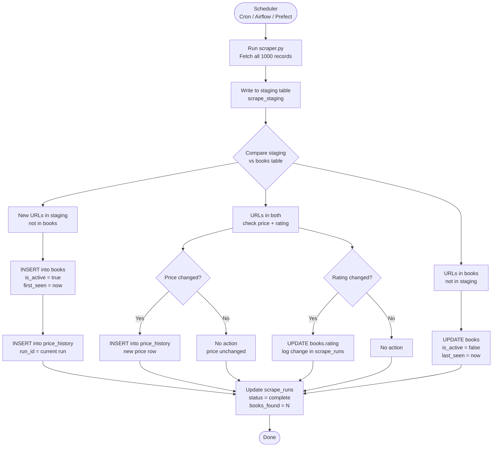

```mermaid
flowchart TD
    A([Scheduler\nCron / Airflow / Prefect]) --> B[Run scraper.py\nFetch all 1000 records]
    B --> C[Write to staging table\nscrape_staging]

    C --> D{Compare staging\nvs books table}

    D --> E[New URLs in staging\nnot in books]
    D --> F[URLs in both\ncheck price + rating]
    D --> G[URLs in books\nnot in staging]

    E --> E1[INSERT into books\nis_active = true\nfirst_seen = now]
    E1 --> E2[INSERT into price_history\nrun_id = current run]

    F --> F1{Price changed?}
    F1 -->|Yes| F2[INSERT into price_history\nnew price row]
    F1 -->|No| F3[No action\nprice unchanged]

    F --> F4{Rating changed?}
    F4 -->|Yes| F5[UPDATE books.rating\nlog change in scrape_runs]
    F4 -->|No| F6[No action]

    G --> G1[UPDATE books\nis_active = false\nlast_seen = now]

    E2 & F2 & F3 & F5 & F6 & G1 --> H[Update scrape_runs\nstatus = complete\nbooks_found = N]

    H --> I([Done])
```