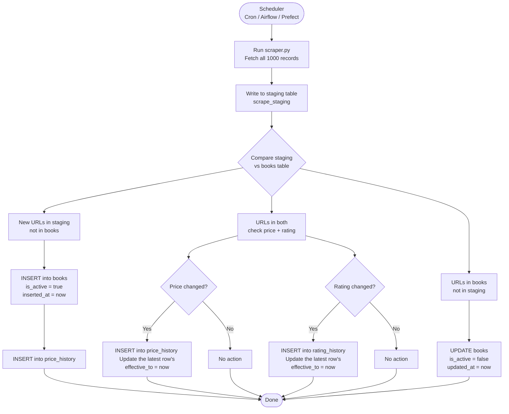

### Diagram 2: Data Change Detection

### Key Design Decision

| Decision                 | Reasoning                                                                                                                                                                                    |
| ------------------------- | ------------------------------------------------------------------------------------------------------------------------------------------------------------------------------------------ |
| `scrape_staging`          | Temporary table holding the latest raw scrape. Wiped and reloaded each run. Prevents partial writes from corrupting the live `books` table.                                                |
| Diff logic (D to E/F/G)   | Three-way comparison: new arrivals, existing books to check for changes, and books that have disappeared. Each branch is independent, so a price change does not affect removal detection. |
| Soft delete (`is_active`) | Books that vanish from the catalogue are marked inactive, not deleted. `last_seen` tells us exactly when they disappeared. Price history is fully preserved for trend analysis.           |
| Scheduler                 | Any cron-compatible tool works here. Daily frequency is sufficient for a slow-changing book catalogue. The design supports higher frequency without any changes to the schema.             |
