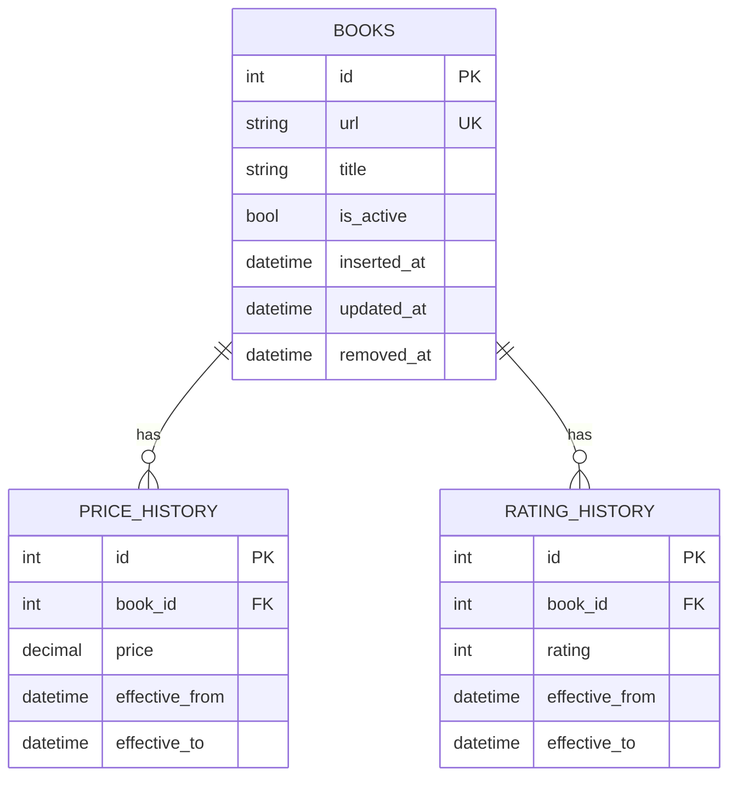

### Diagram 1: Normalized Relational Schema (ERD)

### Key Design Decisions

| Decision                                              | Reasoning                                                    |
| ----------------------------------------------------- | ------------------------------------------------------------ |
| `books` is the core entity                            | Each row is one catalogue entry identified by a stable `url`, which the site uses as the unique ID per book. All other tables reference it.    Example: `/scott-pilgrims-precious-little-life-scott-pilgrim-1_987` |
| Price lives in `price_history`, not `books`           | Keeps the full historical record intact. Current price is row for that `book_id` where effective_to is NULL.  No data is lost when a price changes. This is the mechanism for change detection shown in Diagram 2. |
| Rating lives in `rating_history`, not books           | Keeps the full historical rating record traceable. Current rating is row for that book_id where effective_to is NULL. No data is lost when a rating changes. |
| `is_active` flag on `books`                           | Soft-delete approach: when a book disappears from the catalogue we set `is_active = false` and note `removed_at`. Hard deletes would break the price history foreign key chain. |
| `inserted_at` and `removed_at` on `books`             | `inserted_at` records when a book first appeared in the catalogue. `removed_at` records when it was last observed — set on the run where `is_active` flipped to false. Together they give the full lifespan of a catalogue entry without needing to query the history tables. |
| `effective_from` and `effective_to` on history tables | This enables to do a point in time historical query for prices and rating by simply querying a table with  `where <desired_date> between effective_from and effective_to` . No more unnecessary rows scan. |
