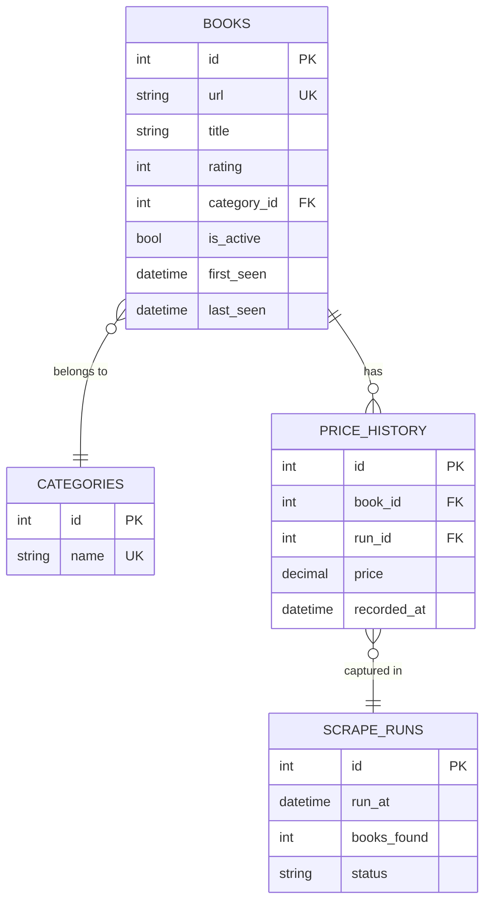

# Diagram 1 — Entity Relationship Diagram

### Key Design Decisions

| Decision                                    | Reasoning                                                                                                                                                                                                                                                                                                                                                                                                                                                                                                                                                                                                                                                                                 |
| ------------------------------------------- | ----------------------------------------------------------------------------------------------------------------------------------------------------------------------------------------------------------------------------------------------------------------------------------------------------------------------------------------------------------------------------------------------------------------------------------------------------------------------------------------------------------------------------------------------------------------------------------------------------------------------------------------------------------------------------------------- |
| `books` is the core entity                  | Each row is one catalogue entry identified by a stable `url`, which the site uses as the canonical ID per book. All other tables reference it.                                                                                                                                                                                                                                                                                                                                                                                                                                                                                                                                            |
| `url` as natural unique key on `books`      | The URL encodes a slug that never changes for a given book on this site. More readable than a surrogate key when debugging. Example: `/scott-pilgrims-precious-little-life-scott-pilgrim-1_987`                                                                                                                                                                                                                                                                                                                                                                                                                                                                                           |
| Price lives in `price_history`, not `books` | Keeps the full historical record intact. Current price is just the latest row for that `book_id`. No data is lost when a price changes. This is the mechanism for change detection shown in Diagram 2.                                                                                                                                                                                                                                                                                                                                                                                                                                                                                    |
| `rating` on `books`, not in history         | Rating on this site appears editorial and static. If it ever changed, the change detection flow in Diagram 2 would catch it and we could promote rating to a history table at that point.                                                                                                                                                                                                                                                                                                                                                                                                                                                                                                 |
| `is_active` flag on `books`                 | Soft-delete approach: when a book disappears from the catalogue we set `is_active = false` and note `last_seen`. Hard deletes would break the price history foreign key chain.                                                                                                                                                                                                                                                                                                                                                                                                                                                                                                            |
| `categories` normalised out                 | Storing category as a raw string on `books` would repeat `"Mystery"` hundreds of times across rows. Instead, `categories` holds each name exactly once and `books` references it via `category_id`. Two concrete benefits: a typo like `"Mysetery"` cannot silently create a phantom category since the FK constraint rejects unknown values, and aggregations like counting books per category work correctly because every book in a category points to the same row, not a loose string. The trade-off is one extra JOIN, which is negligible at this scale. Note: the current scraper does not collect category data, but the product page exposes it and the schema is ready for it. |
| `scrape_runs` as audit log                  | Every run records timestamp, count, and status. This makes diffs possible since change detection compares run N against run N-1. If a run fails mid-way, `status` reflects it and downstream consumers can skip that run's data entirely.                                                                                                                                                                                                                                                                                                                                                                                                                                                 |
| `first_seen` and `last_seen` on `books`     | `first_seen` records when a book first appeared in the catalogue. `last_seen` records when it was last observed — set on the run where `is_active` flipped to false. Together they give the full lifespan of a catalogue entry without needing to query `price_history`.                                                                                                                                                                                                                      