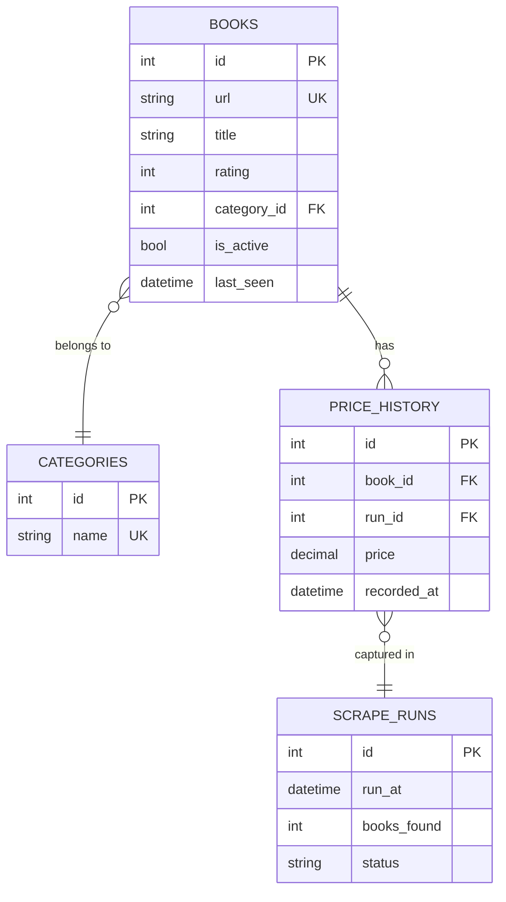

# Diagram 1 — Entity Relationship Diagram

## Key Decisions

| Decision | Reasoning |
|---|---|
| `books` is the core entity | Each row is one catalogue entry identified by a stable `url`, which the site uses as the canonical ID per book. All other tables hang off it. |
| `url` as natural unique key on `books` | The URL encodes a slug that never changes for a given book on this site. More readable than a surrogate key for debugging. Example `/scott-pilgrims-precious-little-life-scott-pilgrim-1_987` |
| Price lives in `price_history`, not `books` | Keeps the historical record intact. Current price = latest row for that `book_id`. No data is lost when price changes. This is the mechanism for change detection in Diagram 2. |
| `rating` on `books`, not in history | Rating on this site appears editorial and static. If it changed we'd detect it via change detection (Diagram 2) and could promote it to a history table later. |
| `is_active` flag on `books` | Soft-delete: when a book disappears from the catalogue we set `is_active = false` and note `last_seen`. Hard deletes would destroy the price history foreign key chain. |
| `categories` normalised out | Storing category as a raw string directly on `books` would repeat `"Mystery"` hundreds of times, once per book. Instead, `categories` holds each name exactly once and `books` references it via `category_id` (an integer FK). Two concrete benefits:  1. A typo like `"Mysetery"` on one row can't silently create a phantom category, the FK constraint rejects any value that isn't in `categories`.  2. Aggregations like `SELECT name, COUNT(*) FROM books JOIN categories ON category_id = categories.id GROUP BY name` work correctly because every Drama book points to the same row, not a loose string that could vary by whitespace or capitalisation.  The trade-off is one extra JOIN, which is negligible at this scale. Note: the current scraper does not collect category, but the product page exposes it, the schema is ready for it. |
| `scrape_runs` as audit log | Every run records timestamp, count, and status. This is what makes diffs possible, change detection compares run N against run N-1. If a run fails mid-way, `status` reflects it and downstream consumers can skip that run's data entirely. |
