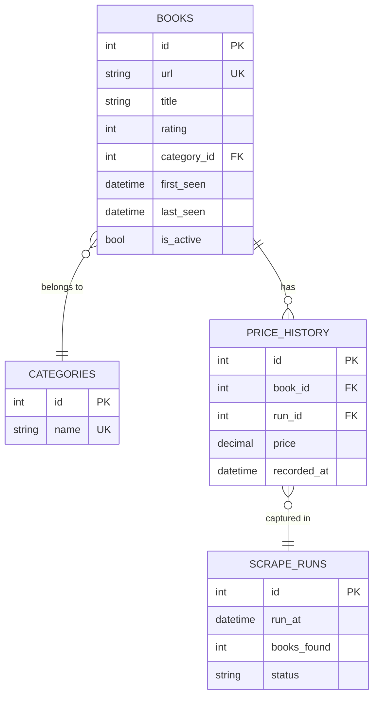
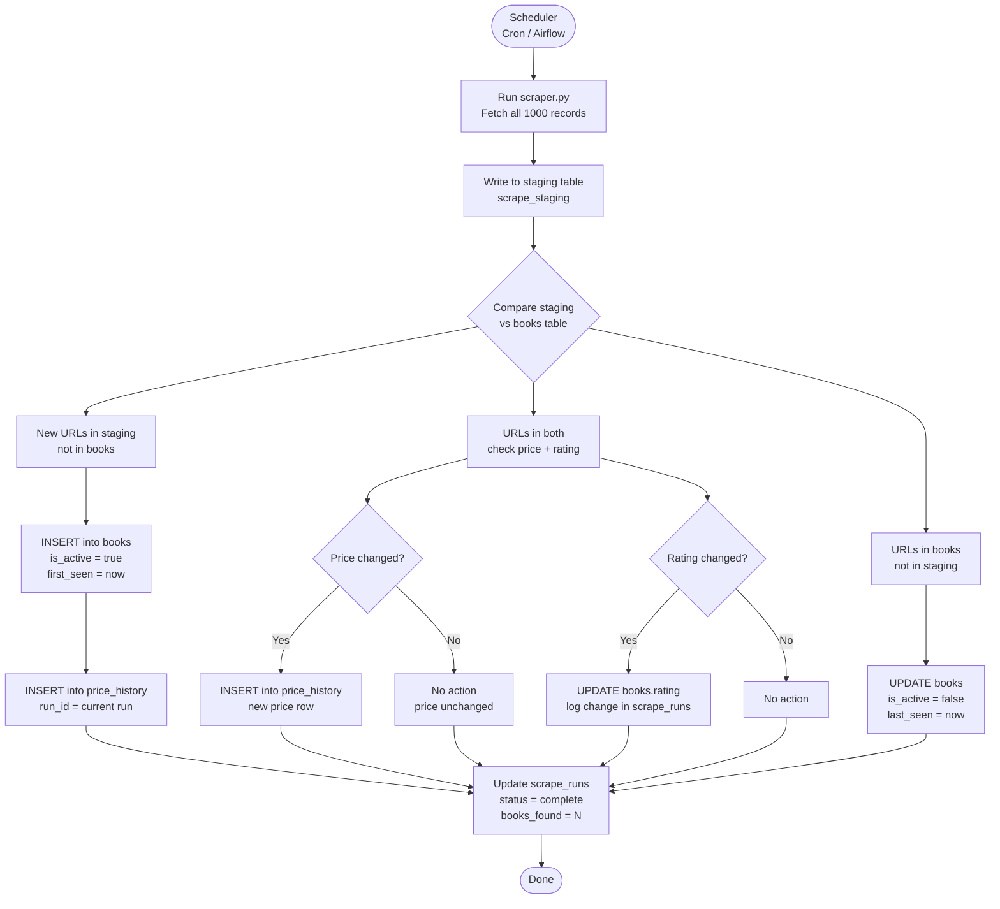

# What I thought & What I tried.

---

## HTML sturcture Observations
## Fields Structures
### Title, Price, Url
#### This was the html structure for title, price and URL. The title was inside anchor (a) tag, price in the class product_price > price_color and url in href of the anchor tag.

### Rating
#### The rating was present in the p tag with class star-rating and the css was given in accordance with the ratings given from which we can fetch how much rating was obtained.

### Pagination
#### The pagination is present in the list with class next and the url was a relative url which I needed to further merge with the base URL to get the full URL. Each page has 50 items so the counter increased as page- x+1 fetching 50 items at once

# Field Observations

### 1. The price field has an encoding artifact, not just a currency symbol
The raw HTML price looks like `£53.74` in some environments. The pound sign (`£`) is a multi-byte UTF-8 character that renders as `£` when a page is decoded with the wrong encoding. Rather than stripping a known leading character like `£`, I stripped everything that isn't a digit or decimal point. This is more defensive: it handles both the clean and corrupted rendering without needing to hardcode a character. Also we are saved if any other strings come by.

### 2. Book titles are truncated in the `<a>` tag text but full in the `title` attribute
The visible link text for long titles is cut off with `...` (e.g., `"A Light in the ..."`). The full title lives in the `title` attribute of the same `<a>` tag. If I had used `.text` instead of `["title"]`, roughly 30/40 books with long names would have been stored incorrectly. This is the kind of thing that passes silently,  the CSV looks fine until we compare against the actual book pages.

### 3. Rating is encoded as a CSS class word, not a structured attribute
Star rating is stored as a class on the `
` element: `
`. There is no `data-rating` attribute or numeric value anywhere in the HTML. I mapped the word to an integer using a static dict (`RATING_MAP`).  Also for the data with missing ratings, we set it Zero. This breaks silently if the site ever introduces a "Seven" or "Six" class, a value of `0` would appear in the output without raising an error. An alternative would be to raise on unknown class values, but that would halt the entire scrape for one bad record. I chose silent default (`0`) with the expectation that a downstream schema constraint would catch it.

### 4. Relative URLs in pagination use `../` in deeper catalogue paths
On page 1, the "next" button href is `page-2.html` — relative to `BASE_URL`. But on some other fields I see a relative url in format `../`, just to remove this case if encountered,  I normalised this by stripping all `../` segments before appending to `BASE_URL`. This would break on a site with real directory nesting and the cleaner approach would be `urllib.parse.urljoin`, which I considered but skipped to avoid over-engineering a site that doesn't change.

### 5. I chose `requests` + `BeautifulSoup` over Scrapy deliberately
We ofcourse have other tools for this usecase like scrapy. Scrapy adds a full framework: spiders, pipelines, settings, middlewares. For a 50-page linear crawl with no JavaScript rendering, it would be roughly 4x more code for the same output. I added a `0.5s` crawl delay manually to prevent overhead to servers fetching continiously. The trade-off: no built-in rate limiting, no distributed crawl support, and no automatic retry queue. For this scope, those are acceptable gaps.

---

## Design

### Diagram 1 — ERD: Normalized Relational Schema and Entity Relationship Diagram

## Key Decisions

| Decision | Reasoning |
|---|---|
| `url` as natural unique key on `books` | The URL encodes a slug that never changes for a given book on this site. More readable than a surrogate key for debugging. |
| Price lives in `price_history`, not `books` | Keeps the historical record intact. Current price = latest row for that `book_id`. No data is lost when price changes. |
| `rating` on `books`, not in history | Rating on this site appears editorial and static. If it changed we'd detect it via change detection (Diagram 2) and could promote it to a history table later. |
| `is_active` flag on `books` | Soft-delete: when a book disappears from the catalogue we set `is_active = false` and note `last_seen`. Hard deletes would destroy the price history foreign key chain. |
| `categories` normalised out | Avoids repeating `"Mystery"` as a raw string per row. Enables clean aggregations like `COUNT(*) GROUP BY category`. |

**Key decisions:**

- `books` is the core entity. Each row is one catalogue entry identified by a stable `url` (which the site uses as the canonical ID per book).
- `categories` is extracted into its own table. The scraper as written does not collect category, but the product page does expose it. Normalising it out avoids the string `"Mystery"` being repeated 200 times in `books`.
- `price_history` captures point-in-time price snapshots. This is the mechanism for objective 03's change detection (see Diagram 2). Price is not stored directly on `books` — the current price is always the latest row in `price_history` for that `book_id`.
- `scrape_runs` logs each execution: timestamp, number of records found, and status. This table is what makes diffs possible — you compare run N against run N-1.

### Diagram 2 — Data Change Detection

## Design Notes

| Component | Purpose |
|---|---|
| `scrape_staging` | Temporary table holding the latest raw scrape. Wiped and reloaded each run. Prevents partial writes from corrupting the live `books` table. |
| Diff logic (D → E/F/G) | Three-way comparison: new arrivals, existing books to check for mutations, and disappearances. Each branch is independent — a price change does not affect removal detection. |
| `scrape_runs` log | Every run records timestamp, count, and status. This is the audit trail. If a run fails mid-way, the `status` column reflects it and downstream consumers can skip that run's data. |
| Soft delete (`is_active`) | Books that vanish from the catalogue are marked inactive, not deleted. `last_seen` tells you when they disappeared. Price history is preserved for trend analysis. |
| Scheduler | Any cron-compatible tool works. Daily frequency is sufficient for a slow-changing book catalogue. The design supports higher frequency without changes. |

