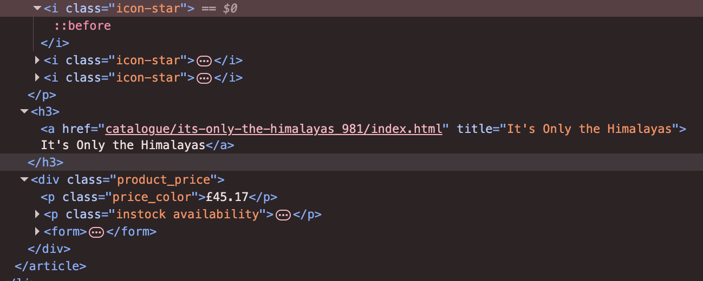
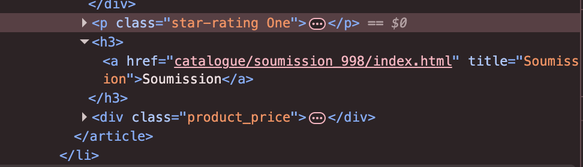
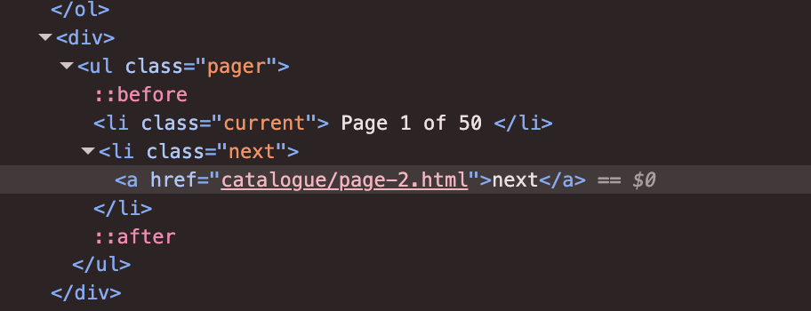
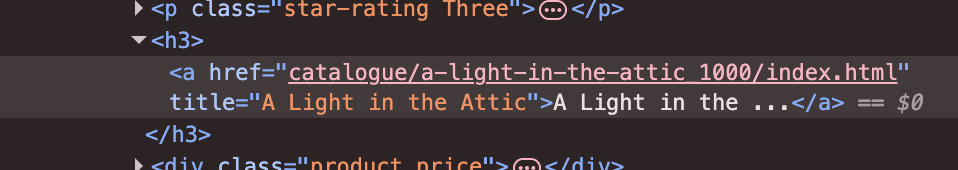
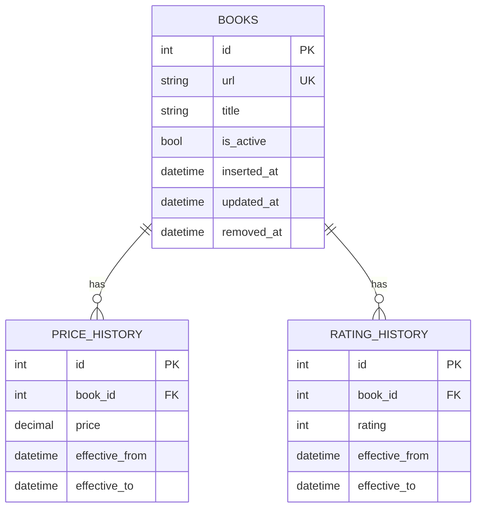
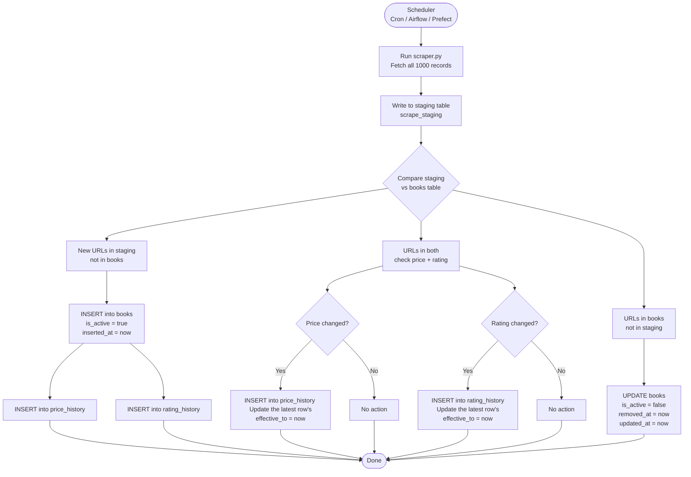

# [My Book Scraper for NexMart](https://github.com/dhakalmahima188/Scrapping-Assignment)

I have created a Python web scraper built to extract book data from [books.toscrape.com](http://books.toscrape.com). It collects titles, prices, ratings, and URLs across all the pages of the catalogue and exports them to a CSV file.


---


### HTML Structure Observations
Before writing lines of scraping logic, I mapped out the DOM. Here's what lives where.

#### Title, Price, and URL

The title lives inside an anchor (`<a>`) tag. The price is in a class called `product_price > price_color`. The URL comes from the `href` of that same anchor tag.



### Rating

The rating sits on a `<p>` tag with the class `star-rating`. The actual star count is encoded as a second CSS class word like `Three` or `Five`. There is no numeric attribute to read directly, so it requires a mapping step.



### Pagination

The pagination "next" button lives inside a `<li class="next">` element. The href is a relative URL that needs to be merged with the base URL to form a full address. Each page holds 20 books, and the scraper walks through all 50 pages sequentially to collect all 1000 records.



---

## Fields Observations and Reasoning

These are the non-obvious things I found while building the scraper. Most of them would have caused silent data corruption if I had not caught them.

### 1. The price field has an encoding artifact, not just a currency symbol

The raw HTML price sometimes looks like `£53.74` depending on how the page is decoded. The pound sign (`£`) is a multi-byte UTF-8 character that renders as `£` when decoded with the wrong encoding. Rather than stripping a known leading character like `£`, I stripped everything that is not a digit or decimal point. This handles both the clean and corrupted rendering without hardcoding any specific character, and it stays safe if other unexpected strings come through. We are safe here.

### 2. Book titles are truncated in the `<a>` tag text but the full title is in the `title` attribute

The visible link text for long titles gets cut off with `...` like `"A Light in the ..."`. The full title lives in the `title` attribute of the same `<a>` tag. Using `.text` instead of `["title"]` would have silently truncated roughly 30 to 40 book names. The CSV would look fine at a glance, but the data would be wrong.



### 3. Rating is encoded as a CSS class word, not a number

Star rating is stored as a class on the `<p>` element like `<p class="star-rating Three">`. There is no `data-rating` attribute or numeric value anywhere in the HTML.


I mapped the word to an integer using a static dictionary called `RATING_MAP`. Books with missing or unrecognised ratings default to `0`. This would break silently if the site ever added a `"Six"` or `"Seven"` class since a value of `0` would appear in the output without raising an error. An alternative would be to raise an exception on unknown class values, but that would halt the entire scrape for one bad record. I chose the silent default with the expectation that a downstream schema constraint would catch it.

### 4. Relative URLs in pagination use `../` in deeper catalogue paths

On page 1, the "next" button href is `page-2.html`, relative to `BASE_URL`. On some other pages and other fields, I noticed relative URLs with `../` prefixes. To handle this uniformly just in case, I stripped all `../` segments before appending to `BASE_URL`. The cleaner approach would be `urllib.parse.urljoin`, which I considered but skipped to avoid over-engineering a site with a predictable and stable URL structure.

### 5. I chose `requests` and `BeautifulSoup` over Scrapy intentionally

Scrapy adds a full framework: spiders, pipelines, settings, and middlewares. For a 50-page linear crawl with no JavaScript rendering, that would be roughly four times more code for the same output. I added a `0.5s` delay between requests manually to be polite to the server. The trade-offs are no built-in rate limiting, no distributed crawl support, and no automatic retry queue. For this scope, those are acceptable gaps.


## Database Design


### Diagram 1: Normalized Relational Schema (ERD)



### Key Design Decisions

| Decision                                              | Reasoning                                                    |
| ----------------------------------------------------- | ------------------------------------------------------------ |
| `books` is the core entity                            | Each row is one catalogue entry identified by a stable `url`, which the site uses as the unique ID per book. All other tables reference it.    Example: `/scott-pilgrims-precious-little-life-scott-pilgrim-1_987` |
| Price lives in `price_history`, not `books`           | Keeps the full historical record intact. Current price is row for that `book_id` where effective_to is NULL.  No data is lost when a price changes. This is the mechanism for change detection shown in Diagram 2. |
| Rating lives in `rating_history`, not books           | Keeps the full historical rating record traceable. Current rating is row for that book_id where effective_to is NULL. No data is lost when a rating changes. |
| `is_active` flag on `books`                           | Soft-delete approach: when a book disappears from the catalogue we set `is_active = false` and note `removed_at`. Hard deletes would break the price history foreign key chain. |
| `inserted_at` and `removed_at` on `books`             | `inserted_at` records when a book first appeared in the catalogue. `removed_at` records when it was last observed — set on the run where `is_active` flipped to false. Together they give the full lifespan of a catalogue entry without needing to query the history tables. |
| `effective_from` and `effective_to` on history tables | This enables to do a point in time historical query for prices and rating by simply querying a table with  `where <desired_date> between effective_from and effective_to` . No more unnecessary rows scan. |

### Diagram 2: Data Change Detection



### Key Design Decision

| Decision                 | Reasoning                                                                                                                                                                                    |
| ------------------------- | ------------------------------------------------------------------------------------------------------------------------------------------------------------------------------------------ |
| `scrape_staging`          | Temporary table holding the latest raw scrape. Wiped and reloaded each run. Prevents partial writes from corrupting the live `books` table.                                                |
| Diff logic (D to E/F/G)   | Three-way comparison: new arrivals, existing books to check for changes, and books that have disappeared. Each branch is independent, so a price change does not affect removal detection. |
| Soft delete (`is_active`) | Books that vanish from the catalogue are marked inactive, not deleted. `removed_at` tells us exactly when they disappeared. Price history is fully preserved for trend analysis.           |
| Scheduler                 | Any cron-compatible tool works here. Daily frequency is sufficient for a slow-changing book catalogue. The design supports higher frequency without any changes to the schema.             |

### Example Queries

**New books captured in this current run:**

```sql
SELECT * 
FROM stg_books 
LEFT JOIN books 
ON stg_books.url = books.url 
WHERE books.url is NULL
```

**Deleted books from the site**

```sql
SELECT * 
FROM books 
LEFT JOIN stg_books 
ON stg_books.url = books.url 
WHERE stg_books.url is NULL
```

**Books whose price and rating has changed**

```sql
-- price  changed
SELECT books.id, stg_books.price
FROM books
INNER JOIN price_history
	ON books.id = price_history.book_id AND price_history.effective_to is NULL
INNER JOIN stg_books 
	ON stg_books.url = books.url
WHERE stg_books.price <> price_history.price

-- rating changed
SELECT books.id, stg_books.rating 
FROM books
INNER JOIN rating_history
	ON books.id = rating_history.book_id AND rating_history.effective_to is NULL
INNER JOIN stg_books 
	ON stg_books.url = books.url
WHERE stg_books.rating <> rating_history.rating
```


---


## Summary

### Schema (ERD)

The normalized schema has 3 tables:

- `books` -- one row per unique book, identified by URL
- `price_history` -- every price observation for a book
- `rating_history` -- every rating observation for a book

Current price is the latest `price_history` row for a given `book_id` where `effective_to` is NULL. Books that disappear from the site are soft-deleted with `is_active = false`, which preserves all historical pricing and rating data.

### Change Detection

Each run writes to a `scrape_staging` table first. A diff then classifies every record into one of three buckets:

- **New URL** -- insert into `books`, log the first price in `price_history`
- **Existing URL, price or rating changed** -- insert a new row in the relevant history table
- **Existing URL, gone from site** -- set `is_active = false`, record `removed_at`

---

*Thank You! By [@Mahima Dhakal](https://github.com/dhakalmahima188/Scrapping-Assignment)*
